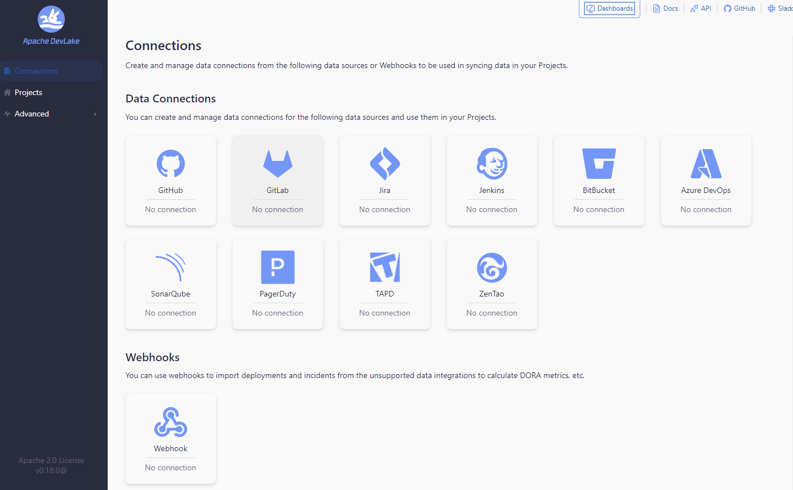

# Apache DevLake CI/CD pipeline

Deploy Apache DevLake server with CI/CD on Elestio

 
 

# Once deployed ...

You can open Apache DevLake UI here:

    URL: https://[CI_CD_DOMAIN]
    login: "admin"
    password: "[ADMIN_PASSWORD]"

You can open PHPMyAdmin here:

    URL: https://[CI_CD_DOMAIN]:64987
    login: "root"
    password: "[ADMIN_PASSWORD]"
